# Branching and Merging in Eclipse and GitHub

## 1 Make a branch in GitHub to take care of local changes

The branch ensures that working on a temporary inconsistent code base Is not a problem since it is isolated from the main branch (and the stable branch) that users may check out. 
Go to the project and select "branches". The number of existing / active branches is given:

Select new branch and provide the name. Typically, the branch forks from main, but sometimes a small side-branch is needed for a development branch that is not the main branch.

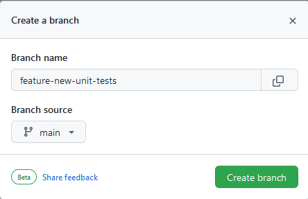
 
names to use are:

* **feature-short-explanation** for extensions, larger repairs, etc.
* **bug-short-explanation** for bug fixes
* **hotfix-short-explanation** for an important fix that will be merged with all active branches

Once the branch is created, it will be shown in GitHub:

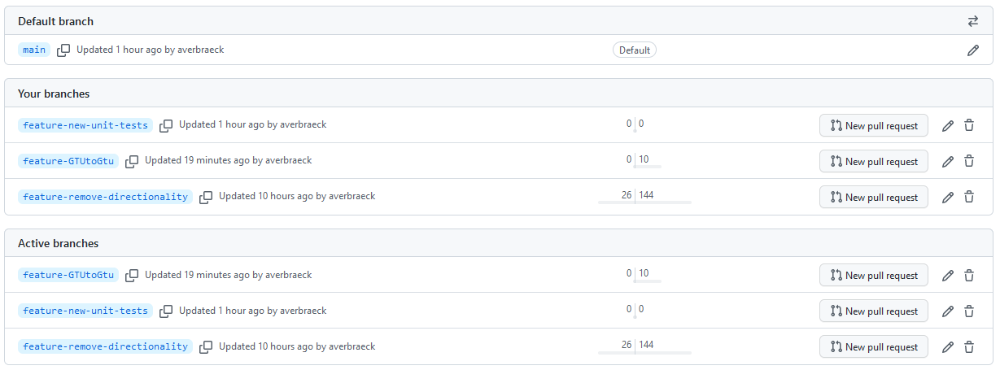

## 2 Pull the branch into Eclipse

In Eclipse, use "Fetch from origin" (either via the toolbar, or via the Team menu on the main project):

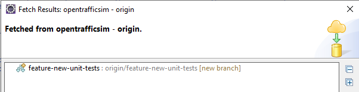
 

Eclipse is now aware of the new branch. If you want to switch to that branch, use Team - Switch-to... on the menu of the entire project. Select "New Branch" since the branch does not yet exist locally:

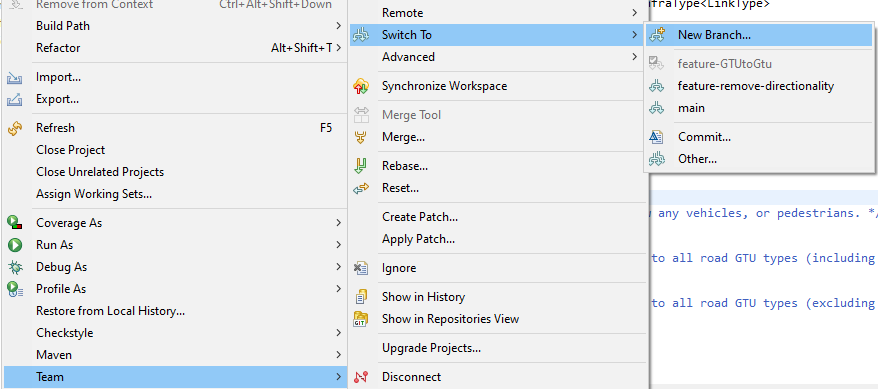

Press the "Select" button and select the new branch:

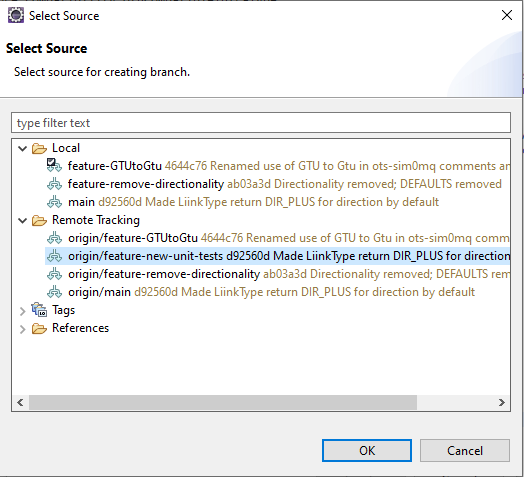

Press OK:

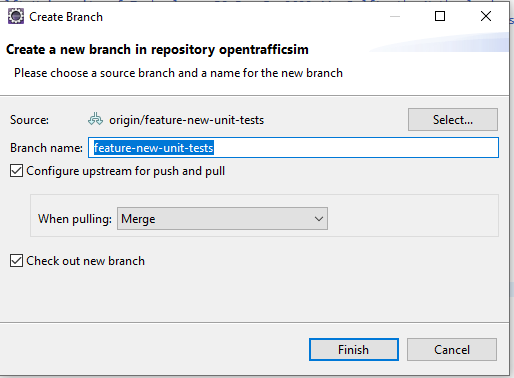

and Finish.

The local git will now point to the branch to work on, isolated from the main branch and other branches:

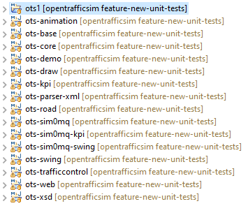
 

## 3 Make changes and push them to GitHub

All changes that you now push will end up in the created branch in GitHub.In this case we repair the method testLinkType() in the LinkTypeTest class.

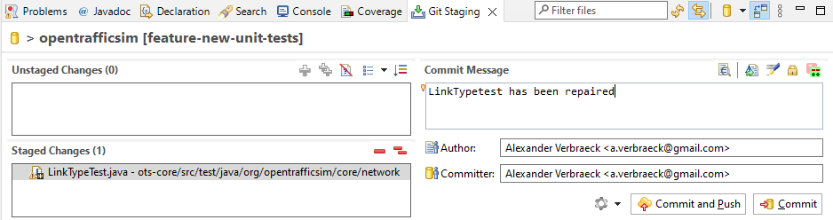

When the result is pushed to GitHub, it clearly shows that it has been pushed to the right branch:

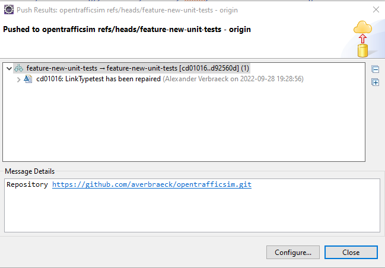

On GitHub this change is also visible:

and

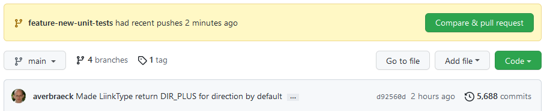

 
## 4 Merging a development branch into the main branch

Make sure all local changes in the development branch are pushed to GitHub.
Switch to the main branch (or to another branch into which changes have to be merged -- for a hotfix, changes might have to be merged into multiple branches). Use Team - Switch to... - main in the main project folder. The folder structure should now show that you are back to the main branch:

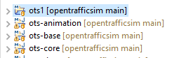

Make sure you fetch all changes that have been pushed by others to GitHub for the main branch.

Select Team - Merge... in the main project folder:

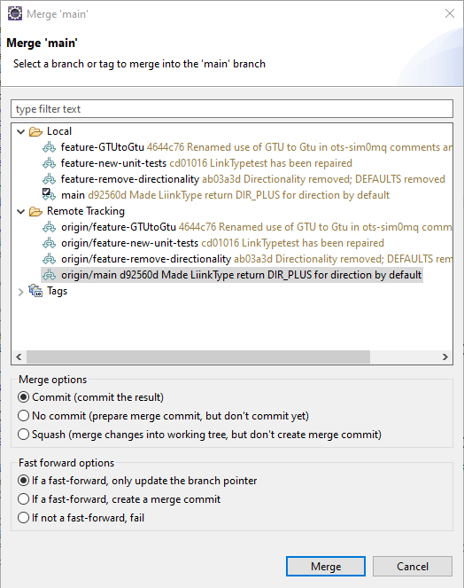
 

Select the **Local** branch to merge **into** the main branch that is now open:

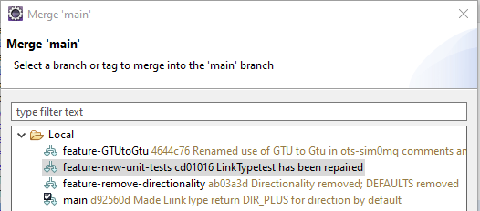
 
and press Merge. The commit and fast-forward defaults are fine.

It will merge the two branches into main. 

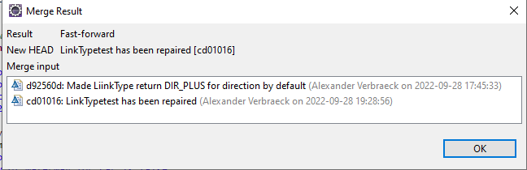
 
When there are no conflicts, the results can be pushed with Push HEAD ...

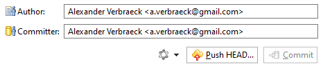

By the way, Eclipse also shows in the project folder structure that there are still changes to be pushed:

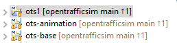

In Push HEAD:

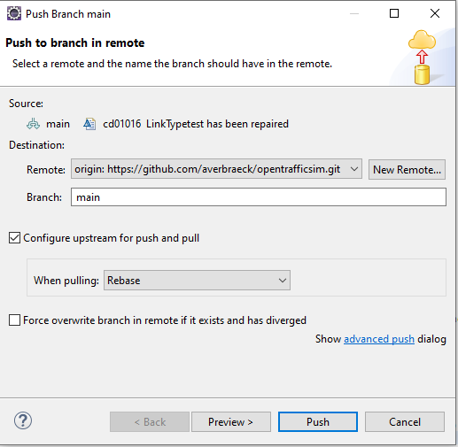

Press "Push", and the combined (merged) results are in main on GitHub.

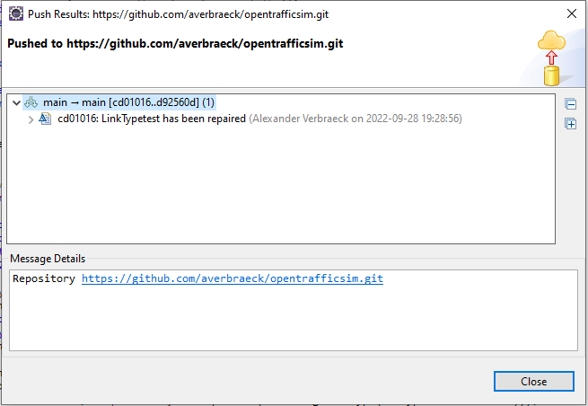
 

GitHub also shows this. The branch "feature-new-unit-tests" is not behind or ahead anymore:

 
0/0 indicates that it is 0 behind the last version of main, and 0 ahead of main from the time it was split.

## 5 Clean up development branch

These is absolutely no need to keep a development branch after it has been merged. It will just get behind, and as a result, become unusable. 
When the development branch is not ahead of 'main' (the numbers indicate x/0), everything has been pushed to GitHub and it is safe to delete.
Delete on GitHub:

and in Eclipse, go to the "Git Repsoitory View":

 
and delete the merged branch there as well, both in Local and Remote Tracking. After that, the status of the main branch is as-if all changes have been directly incorporated in the main branch, and git is unaware a development branch ever existed:

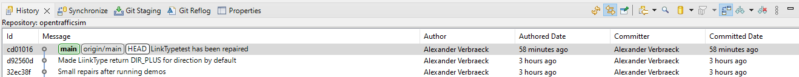

If necessary, update the 'Issues' if an open issue was available for this change.

## 6 Handling merge conflicts

TBD

