# Installing opentrafficsim for code developers

When you are a code developer who has access to update the opentrafficsim code on github, use the instructions below to make ots available on your computer.


## 1. Install Eclipse on your computer

Eclipse is an open-source development environment for, amongst others, Java projects. The Eclipse development environment is available for Windows, Mac, and Linux. The github project has all settings optimized for working in Eclise, but of course you can use your favorite development environment instead of Eclipse.

If you want to use Eclipse, download and install one of the Eclipse development tools via the Eclipse installer: [https://www.eclipse.org/downloads/packages/installer](https://www.eclipse.org/downloads/packages/installer) or more fine-grained from [https://www.eclipse.org/downloads/packages/](https://www.eclipse.org/downloads/packages/). Make sure to take a version for Java development that contains Maven for Eclipse (m2e); the "Eclipse IDE for Java Developers" is probably your best choice. If you want to choose an installation folder in Windows, you might put it in a folder for 'offline installations', such as `c:\app\eclipse` on Windows. Eclipse, as an offline installation, does not install as a regular program, is fully self-contained, and does not rely on the Windows registry. Create a start menu entry or a desktop shortcut for Eclipse to easily start it.

By default, Eclipse starts with a built-in Java version. If you go to the folder where Eclipse has been installed, you see an 'eclipse.ini' file. In this file, there is an indication of the Java version (the 'vm' or Virtual Machine') that is used:

```
-vm
plugins/org.eclipse.justj.openjdk.hotspot.jre.full.win32.x86_64_17.0.1.v20211116-1657/jre/bin
```
So, in this case the Java version that is used is Java version 17, built into Eclipse. This is sufficient to run. You can also install a stable, Long-Term Support (LTS) version of Java yourself -- see the following section what to do in case you want to install a version of Java yourself. If you have installed your own Java version, e.g. version 11 in C:\app\jdk11 for Windows, change the above 'vm' setting to:

```
-vm
C:/app/jdk11/bin
```

The opentrafficsim Java code is dependent on several external libraries to function properly. The easiest way to resolve those dependencies is to have Apache Maven figure out what libraries are needed for the project. [Apache Maven](https://maven.apache.org/) is a flexible and open source build tool that, amongst a large set of functions, enables programmers to automatically resolve dependencies and easily build their project. The Eclipse Java installations all contain Maven, making it really easy to set-up, develop, run, and deploy your project. 

Of course it is possible to use another development environment such as Netbeans ([https://netbeans.org/downloads/](https://netbeans.org/downloads/)) instead of Eclipse, and a build manager such as Gradle ([https://gradle.org/](https://gradle.org/)) instead of Maven. This manual, however, uses Eclipse and Maven as reference examples.


## 2. Installing Java (optional -- you can use the Eclipse version)

For **Windows**, install OpenJDK version 11 (the current LTS = Long Term Support version). Download the zip for Java 11 at [https://jdk.java.net/archive/](https://jdk.java.net/archive/) for your operating system. You can install a later version of Java, but the current version of DSOL has been developed and tested with Java version 11. The best way to install Java is to unpack the Java zip in a folder without spaces in the folder name, e.g., C:\app\jdk11. Make sure to add Java to the current 'Path' (on Windows-10 go to Windows Settings - System - About and click 'Advanced Systems Settings' on the right. Click 'Environment Variables' in the 'Systems Properties' screen. Edit the 'Path' entry and add `C:\app\jdk11\bin` as an entry (adapt for your chosen location). You can move the entry to before 'C:\Windows\system32' to override a Java client in Windows. Add or modify an entry `JAVA_HOME` and set the value to `C:\app\jdk11` (adapt for your chosen location). You can test whether Java works by opening a Command prompt (CMD) and typing `java -version`. If Java responds with with version 11, the installation has succeeded.

For **MacOS**, install OpenJDK version 11, e.g., using the following instruction: [https://techoral.com/blog/java/install-openjdk-11-on-mac.html](https://techoral.com/blog/java/install-openjdk-11-on-mac.html).

For **Debian / Ubuntu** versions of Linux, use the command `sudo apt install openjdk-11-jdk` to install OpenJDK version 11. For

**CentOS / RedHat** versions of Linux, use the command `sudo yum install java-11-openjdk-devel` or `sudo dnf install java-11-openjdk-devel` to install OpenJDK version 11. If you want to know which java installations are available on CentOS / RedHat, type: `yum search jdk` or `dnf search jdk`, and choose the one you want to install.


## 3. Clone the git for opentrafficsim into Eclipse

### 3.1. Start Eclipse and make a workspace

When you start Eclipse, indicate the workspace location. In this case the workspace is stored in E:\java\opentrafficsim\workspace (Windows). But it can also be in c:\users\[username]\eclipse\opentrafficsim (Widows), or fir instance in ~[username]/eclipse/opentrafficsim (on Linux). Note that the name of the folder is free to choose. It can be "opentrafficsim", "opentrafficsim/workspace", "ots" or whatever you prefer.


An opening screen is shown, which can be closed with "Hide":

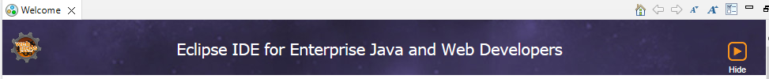

After this, the Workspace for the opentrafficsim project opens:

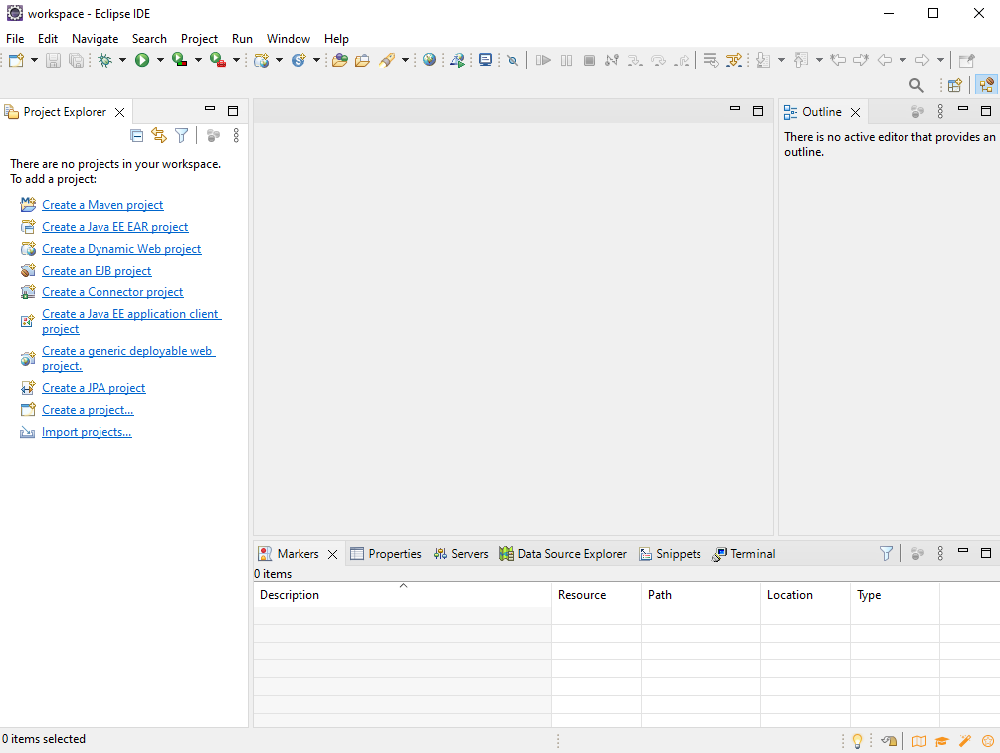

The "perspective" we see is shown with a square icon at the top right. For the example in the figure above, it is the "Java Enterprise Edition" perspective. This is fine, but for a Java project like opentrafficsim, the Java perspective might be more appropriate. Choose the square with the "+" at the top right of the screen, and choose the "Java" perspective:

<center>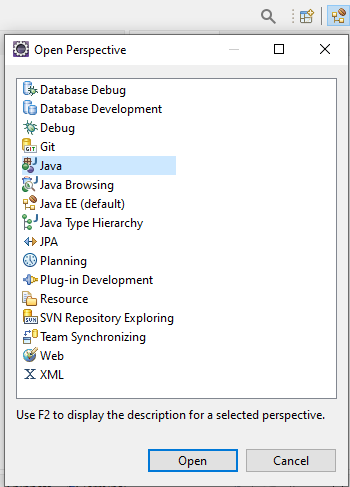</center>

Of course it is possible that the Eclipse distribution that you chose already shows the Java perspective, In that case, leave it as-is. If you want, you can remove the "enterprise edition" perspective, but you can also leave it. 


### 3.2. Clone the opentrafficsim git from github into your project

Choose 'File - Import - Git - Projects from Git' from the menu bar:

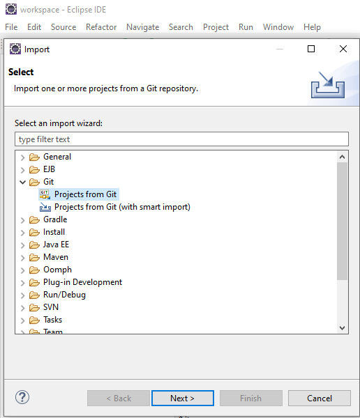

Go to github, and make sure you are logged in. Go to [https://github.com/averbraeck/opentrafficsim](https://github.com/averbraeck/opentrafficsim) and choose "Code". Press the "copy" icon next to Clone - HTTPS:

<center>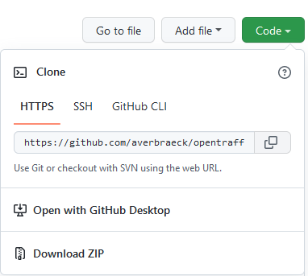</center>

Go back to Eclipse and choose "Clone URI" in the next menu, and press Next:

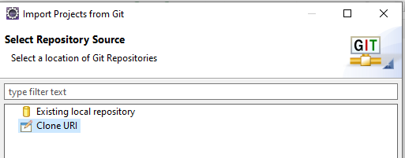

The details for cloning will automatically be filled for you. The first time you do this, you have to provide your github authentication details. If you store them in the Secure Store (see below), you only have to enter them once. Press Next when the information is correct. 

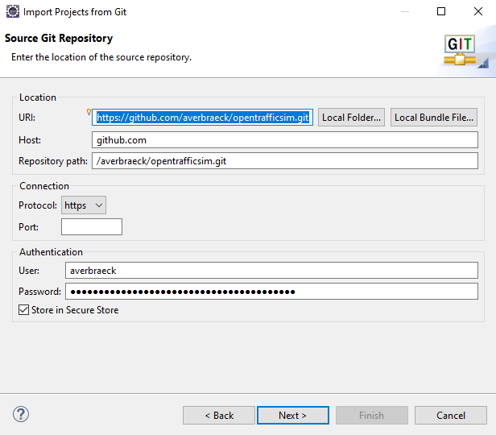

Select only the master branch (and/or any other branch you are interested in) to clone from github and press Next:

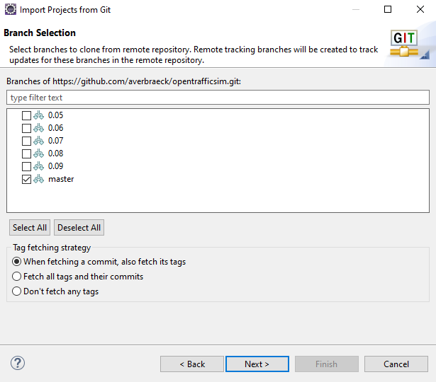

In the next screen, choose where you want to place the cloned git. By default it goes into a 'git' folder in your home directory. In the screen below, I chose a different folder. Do **not** use the same folder as your Eclipse project. 

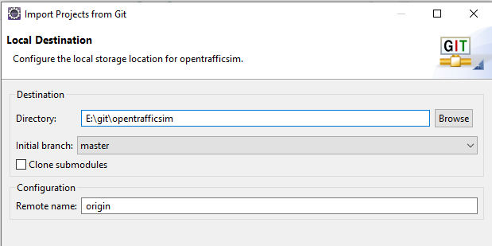

Press Next and indicate you want to import the folders as Eclipse projects:

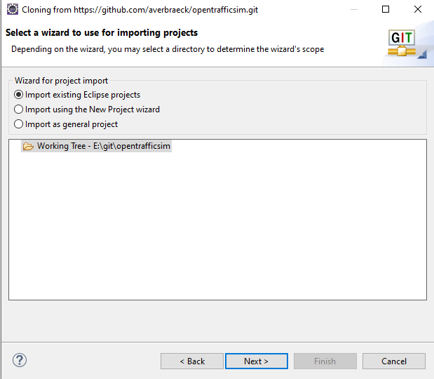

All projects should be shown when you press Next:

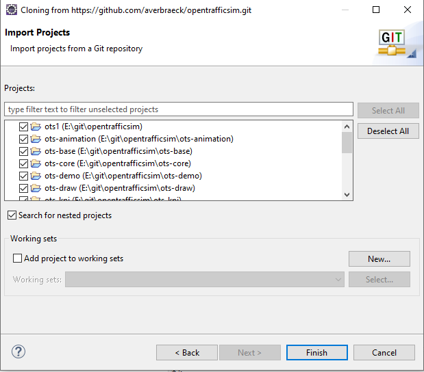

After pressing "Finish", the projects will be imported:

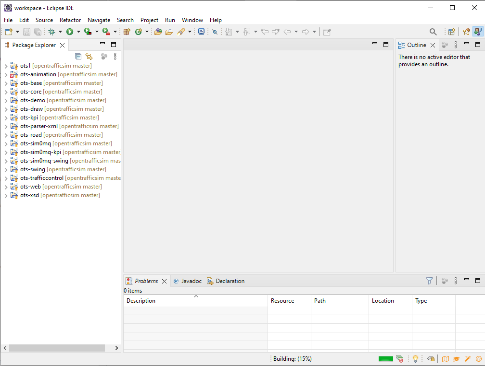

Note that compiling the projects for the first time might take a while. During the compilation, some projects might show an error for a short while, like the ots-animation project in the above image. If errors remain, right click on the "opentraffisim" main project at the top, and select "Maven - Update Project". All errors should be cleared after that (unless you downloaded a version that is in heavy editing -- in that case it is to be expected that sometimes the current version is not 100% stable).

The "Maven - Update project" menu looks as follows:

<center>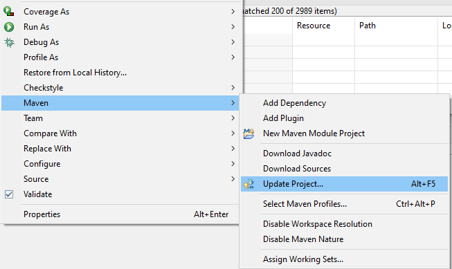</center>

and you can choose all projects:

<center>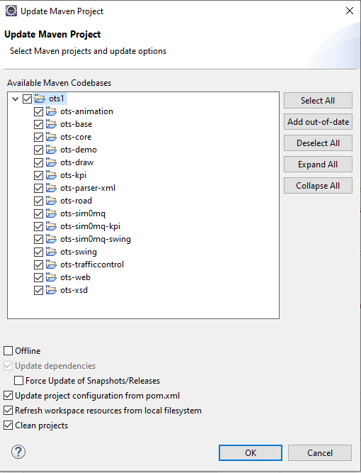</center>

If all has been cleared, you can see and edit all files, and push changes to github:

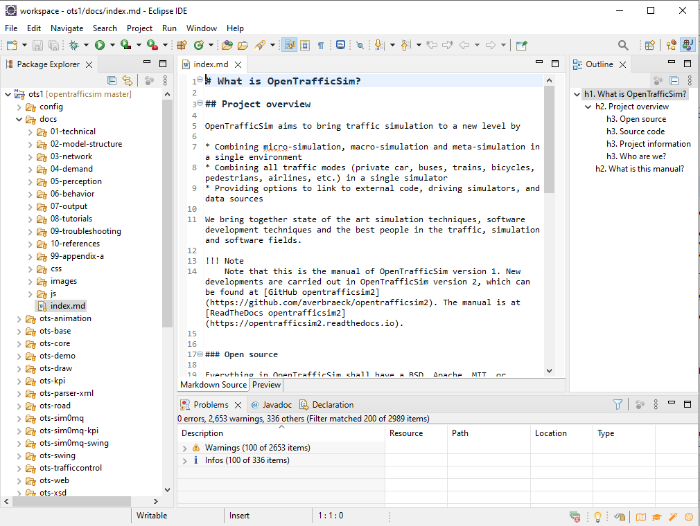


### 3.3. Preparing git to commit, push and pull changes

A simple git staging screen can be opened to help committing changes to the local git, and pushing changes to github. To do this, open the "Git staging" view with "Window - Show View - Other - Git - Git Staging":

<center>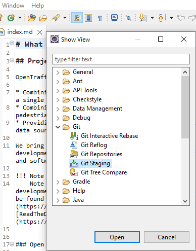</center>

You can also open the Git perspective by clicking on the square perspective icon with the "+" in the top-right corner and choosing "Git":

<center>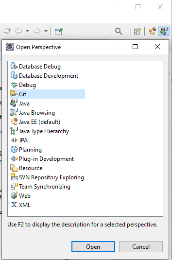</center>

In the Git perspective, you can for instance see the project's (or a folder's or a file's) history:

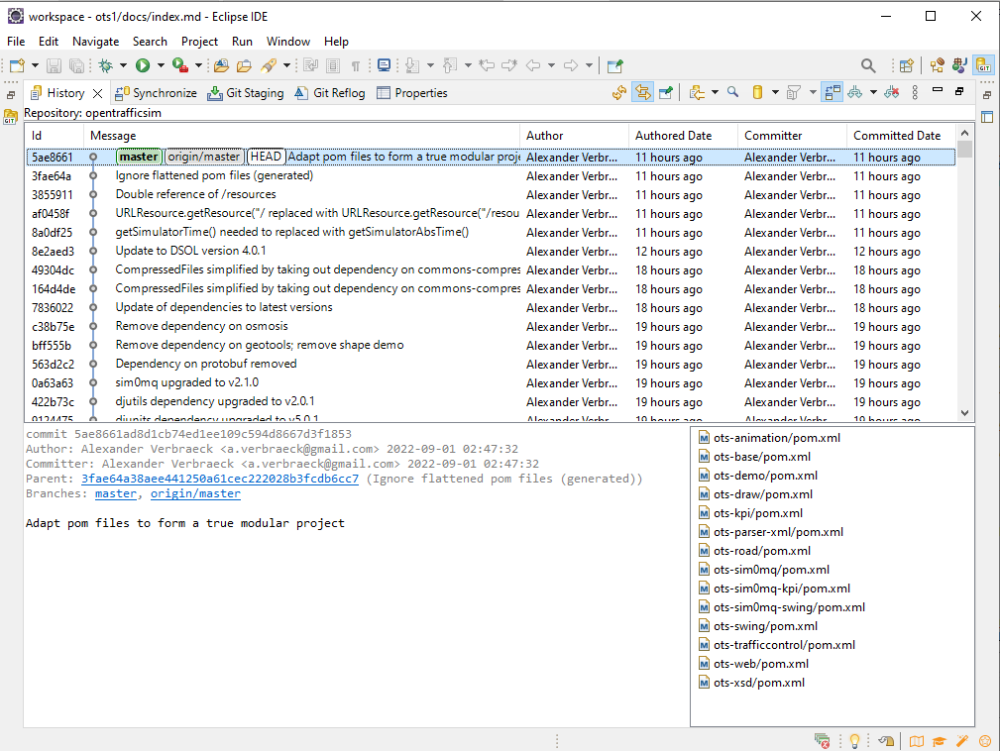

If you want buttons for push-pull in your toolbar below the menus, choose "Window - Perspective - Customize Perspective":

<center>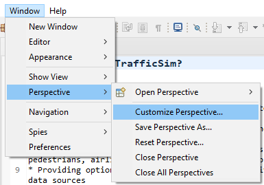</center>

Go to the "Action Set Availability" tab and choose "Git":

<center>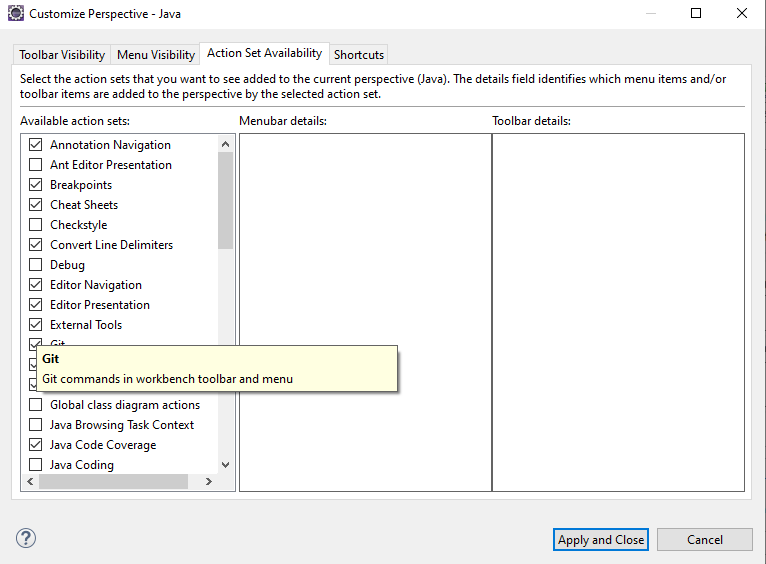</center>

The icons for, e.g., "Push", "Fetch", "Pull", "Commit" and "Merge" will now be visible in the top menu bar in the Java view:

<center></center>


## 4. Using git

This is not a git manual. Git has many options, e.g., to develop code in branches that can shield the sometimes messy development for the "master" branch, and the merge the development branch in the end with the master branch (or abandon the development branch). There are many tutorials available how to use git.

Development should be such that users can typically safely check out the master branch and have a reasonably stable set of code. Of course, to ensure a really stable codebase, end users should only clone a release tag, or use a tested and compiled library via Maven.

Typically, before starting working in the master branch, you **Fetch** the changes from github. When you did not make any local changes, this should never lead to conflicts.

After having worked on some code, you can **Commit** the code to your local git. Do this _frequently_, and do it every time when you have worked on a few changes that clearly relate to each other. Document the change with the "Commit Message". If you made multiple changes that deserve their own message, select the files per group that belong together with the "+" icon, and give then their own appropriate commit message. When you want to commit all files that have been changed, press the "++" icon. Code the commit message with one short line at the top (this will be visible in github next to the file and the parent folders), skip a line, and enter further details below (if necessary):

<center>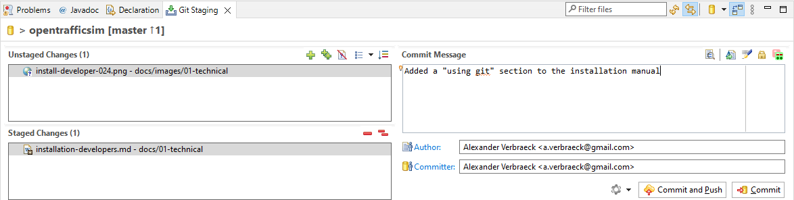</center>

Press "Commit" to copy the code to the local git. Note: the code is then _not yet_ on github.

When you committed and documented several changes to your local git, and code is stable or documents are consistent, you can use "Push HEAD" in the "Git Staging" screen to push all your changes in one go to github. Doing it this way, you ensure that you only push a finalized set of changes to github and not some intermediate mess. Of course, when you expect to work on changes for a considerate amount of time, you can work in a separate development branch and merge the changes later into the master branch. How to do this is beyond the scope of this manual. When you use "Push HEAD", you can choose the branch to push to; in this case it is the master branch:

<center>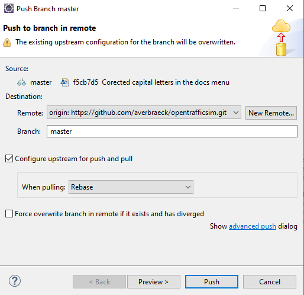</center>

After you pushed to github, you get a confirmation screen about the committed changes you made:

<center></center>

In case there have been others who made changes in the meantime, you get an error message, and you cannot push the head until you fetched the changes from others, and resolved potential conflicts. For conflict resolution and merging, see more extensive git documentation online.


## 5. Github Personal Access Token is needed to push to github

Github does not allow to push updates from a remote computer using the standard github password. Instead, a so-called 'Personal Access Token' is needed that enables a push to github. Other developer features can be allowed / disallowed with a personal access token as well. Read more about this in [https://docs.github.com/en/authentication/keeping-your-account-and-data-secure/creating-a-personal-access-token](https://docs.github.com/en/authentication/keeping-your-account-and-data-secure/creating-a-personal-access-token) and about fine-grained access tokens (new) in [https://github.blog/2022-10-18-introducing-fine-grained-personal-access-tokens-for-github/](https://github.blog/2022-10-18-introducing-fine-grained-personal-access-tokens-for-github/). 

A Personal Access Token acts as a password, but it can be revoked (e.g., if your laptop gets stolen), it can give access to some features and not to others, and with the fine-grained tokens, it can give remote access to the features of certain repositories but not to others. One example of a use case is a script that has to be run on a server that needs access to certain features on github. Password-based access would require you to store or expose your github password (sometimes unencrypted) in/for that script. With tokens you can generate a token for just that purpose and use it in the script. If the server gets compromised, misuse will only consider the permissions relating to that script, and only that token needs to be revoked and regenerated.

You find the way to generate a Personal Access Token under the '**Settings**' menu for your personal account.
- Scroll down and in the left menu select '**<> Developer Settings**'. 
- There, choose '**Personal access tokens**' and '**Tokens (classic)**'. 
- Select '**Generate New token**' at the top, and '**Generate New token (classic)**'
- You can give the token a name and expiration date (or no expiration).
- Minimally tick the '**repo**' options:

```
repo     Full control of private repositories
    repo:status       Access commit status
    repo_deployment   Access deployment status
    public_repo       Access public repositories
    repo:invite       Access repository invitations
    security_events   Read and write security events
```
- Possibly select '**workflow**' to update GitHub Action Workflows, since we use them in our project, and they might be updated from Eclipse. 
- Reading, writing and deleing packages is not needed since we deploy the packages to Maven Central rather than to GitHub.
- For the rest, there is no need to tick any other options since we don't use these options *from Eclipse*. 
- Press '**Generate token**', and use this token **as the password** in Eclipse to access the Git. You use this with your GitHub login name as the usename. So the token *replaces* your GitHub password.
- Store the token in a vault or secure place, since you will need it for other projects where you want to push code to one of your github projects.


