# Installing opentrafficsim for code developers

When you are a traffic simulation modeler who wants to use the opentrafficsim library from github, use the instructions below to include opentrafficsim in your Java project.


## 1. Install Eclipse on your computer

Eclipse is an open-source development environment for, amongst others, Java projects. The Eclipse development environment is available for Windows, Mac, and Linux. The github project has all settings optimized for working in Eclise, but of course you can use your favorite development environment instead of Eclipse.

If you want to use Eclipse, download and install one of the Eclipse development tools via the Eclipse installer: [https://www.eclipse.org/downloads/packages/installer](https://www.eclipse.org/downloads/packages/installer) or more fine-grained from [https://www.eclipse.org/downloads/packages/](https://www.eclipse.org/downloads/packages/). Make sure to take a version for Java development that contains Maven for Eclipse (m2e); the "Eclipse IDE for Java Developers" is probably your best choice. If you want to choose an installation folder in Windows, you might put it in a folder for 'offline installations', such as `c:\app\eclipse` on Windows. Eclipse, as an offline installation, does not install as a regular program, is fully self-contained, and does not rely on the Windows registry. Create a start menu entry or a desktop shortcut for Eclipse to easily start it.

If you want to buid a simulation that uses opentrafficsim, the opentrafficsim and several other libraries have to be added to your program for the simulation to function properly. The easiest way to resolve those dependencies is to have Apache Maven figure out what libraries are needed for the project. [Apache Maven](https://maven.apache.org/) is a flexible and open source build tool that, amongst a large set of functions, enables programmers to automatically resolve dependencies and easily build their project. The Eclipse Java installations all contain Maven, making it really easy to set-up, develop, and runyour traffic simulation project. 

Of course it is possible to use another development environment such as Netbeans ([https://netbeans.org/downloads/](https://netbeans.org/downloads/)) instead of Eclipse, and a build manager such as Gradle ([https://gradle.org/](https://gradle.org/)) instead of Maven. This manual, however, uses Eclipse and Maven as reference examples.


## 2. Seting up your project

### 2.1. Start Eclipse and make a workspace

When you start Eclipse, indicate the workspace location. In this case the workspace is stored in E:\java\traffic (Windows). But it can also be in c:\users\[username]\eclipse\traffic (Widows), or for instance in ~[username]/java/traffic (on Linux). Note that the name of the folder is free to choose. It can be "traffic", "opentrafficsim/MyTrafficSimulation", "ots" or whatever you prefer.

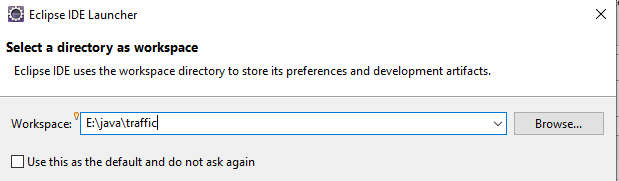

After you press Launch, an opening screen is shown, which can be closed with "Hide":

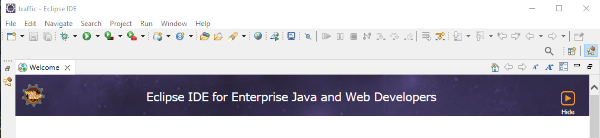

After this, the Workspace for the "traffic" project opens:

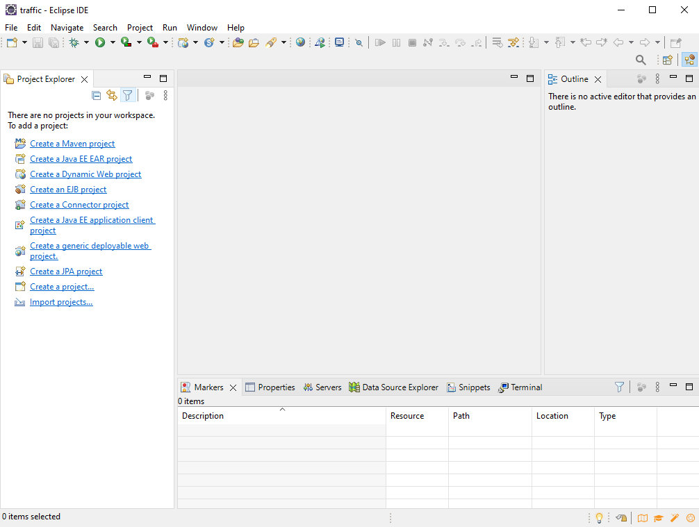

The "perspective" we see is shown with a square icon at the top right. For the example in the figure above, it is the "Java Enterprise Edition" perspective. This is fine, but for a simple Java project, the Java perspective might be more appropriate. Choose the square with the "+" at the top right of the screen, and choose the "Java" perspective:

<center>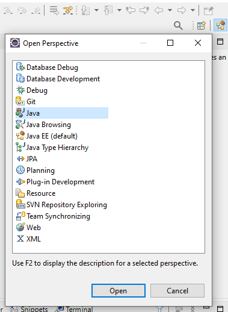</center>

Of course it is possible that the Eclipse distribution that you chose already shows the Java perspective, In that case, leave it as-is. If you want, you can remove the "enterprise edition" perspective, but you can also leave it. 


### 2.2. Create a Java Maven project

Go to the Eclipse menu and choose File - New - Other - Maven - Maven Project:

<center>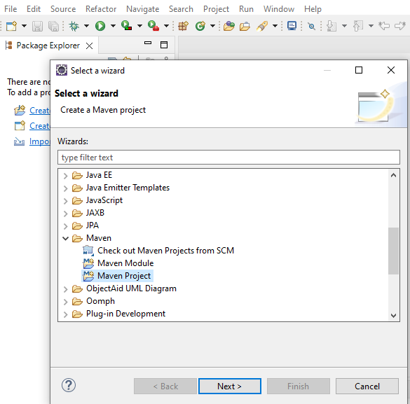</center>

Tick  "Create a simple project" and press "Next":

<center>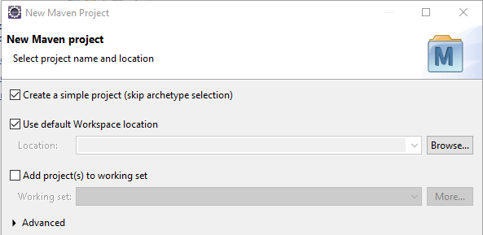</center>

In the next screen, you get to choose three important things:

1. The group id of your project. This often relates to the overarching project or organization that carries out the simulation project. Often, it is a reverse web address such as org.opentrafficsim, or nl.tudelft.simulation. But you can also choose any other identifier, where parts are separated by periods. Do not include any spaces in the name. Usually, only lower case letters are used. Here, we will choose simply "traffic" as the group id.
2. The artifact id of the project. This uniquely identifies the project within the group. No spaces, no periods. Dashes are okay. Typically, use lowercase only. Here we choose traffic-demo as the artifact id. 
3. The version number can be helpful if you develop iteratively. Typically version numbers follow major.minor or major.minor.small as version numbers. Here, we chose 0.1 as the version number.

You can also fill the Name and Description of the project, but it is not compulsory.

<center>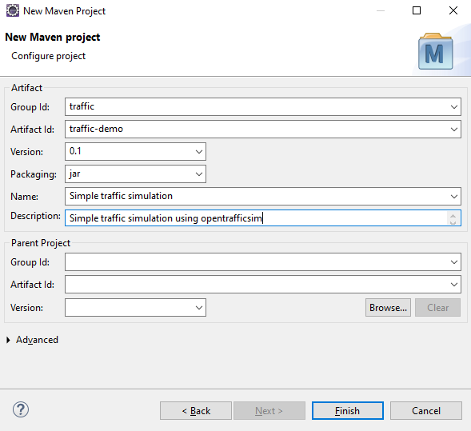</center>

Press "Finish". Your project will have been created. The information about the Maven part is stored in an XML-file called pom.xml in the root folder. This file orchestrates the dependencies and building of your project, comparable to a make file in C/C++. 

<center>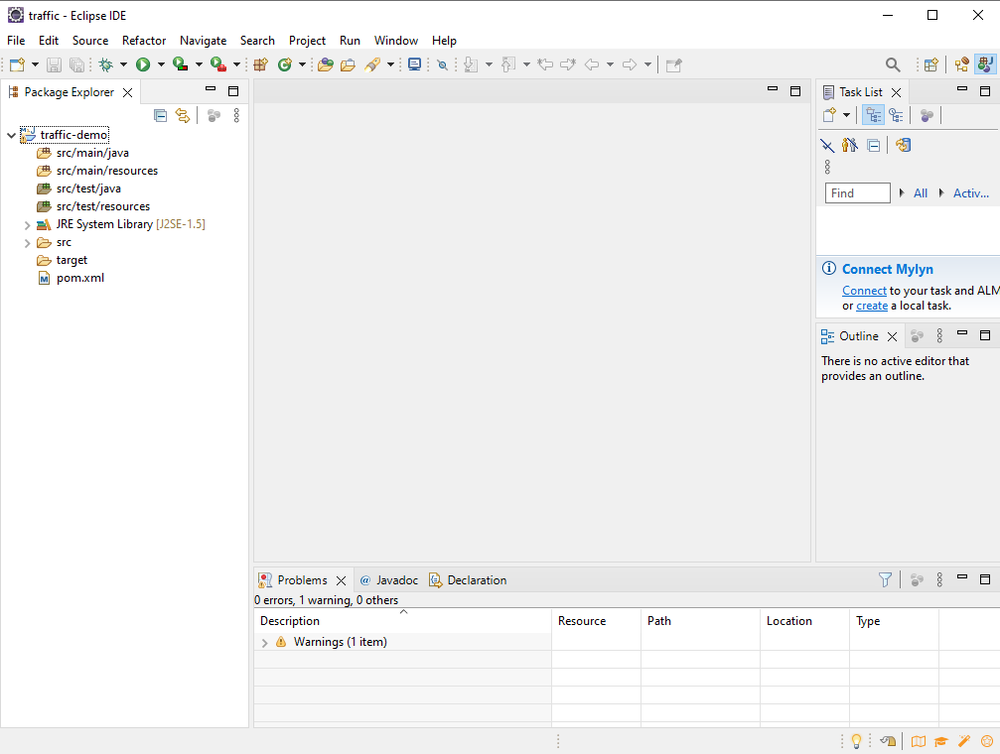</center>


### 2.3. Make the opentrafficsim libraries available to the Java project

Double click the pom file. You can see the information you added above in the XML structure:

```xml
<project xmlns="http://maven.apache.org/POM/4.0.0" ...>
  <modelVersion>4.0.0</modelVersion>
  <groupId>traffic</groupId>
  <artifactId>traffic-demo</artifactId>
  <version>0.1</version>
  <name>Simple traffic simulation</name>
  <description>Simple traffic simulation using opentrafficsim</description>
</project>
```

The first thing we need to do is telling Eclipse that we want to use UTF-8 encoding and Java 17, and not version 1.5. We do that by including the following properties at the bottom, but _inside_ the project tags:

```xml
  <properties>
    <jdk.version>17</jdk.version>
    <maven.compiler.source>17</maven.compiler.source>
    <maven.compiler.target>17</maven.compiler.target>
    <project.build.sourceEncoding>UTF-8</project.build.sourceEncoding>
  </properties>
```

Save the pom file, and use the right mouse button on the project name at the left (traffic-demo), choose Maven - Update Project, and press Ok. The library should now be updated to Java 17:

<center>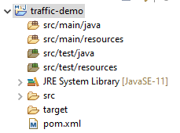</center>

By the way, this can also be uppdated in the Overview tab for the pom file:

<center>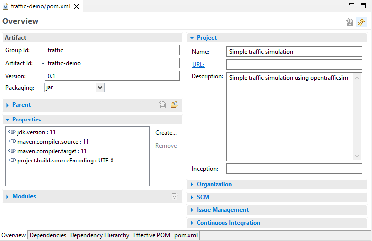</center>

The dependencies to the opentrafficsim libraries have to be included as part of the project, again in the pom file inside the project tag. Suppose we want to use ots-road (lane-based traffic simulation) and ots-swing (animation and interactive screen). We then indicate the following dependencies. This can be done using the "Dependency" tab in the editor. Press Add... for the Dependencies (so _not_ for Dependency Management). Choose 'org.opentrafficsim' for the groupId, 'ots-road' for the artifactId, and 1.6.0 (or later -- see GitHub for the latest stable release) as the version number:

<center>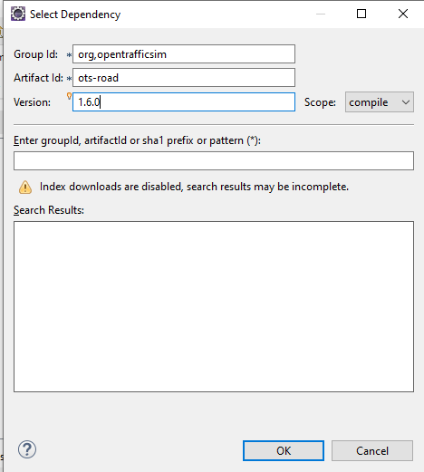</center>

Repeat the same for ots-swing. This should result in:

<center>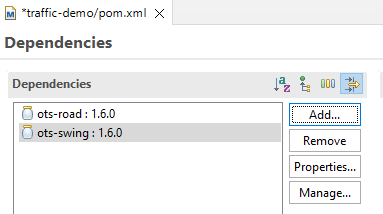</center>

In the pom.xml file view, the dependency information has been encoded as XML -- you can also type or paste it directly there:

```xml
  <dependencies>
    <dependency>
      <groupId>org.opentrafficsim</groupId>
      <artifactId>ots-road</artifactId>
      <version>1.6.0</version>
    </dependency>
    <dependency>
      <groupId>org.opentrafficsim</groupId>
      <artifactId>ots-swing</artifactId>
      <version>1.6.0</version>
    </dependency>
  </dependencies>
```

Press the "Save" button (or Ctrl/S). Now the libraries are available to you, including Javadoc (help files) and the source code of the libraries. There are many modules in ots -- see Github for the available modules that you can include in your project. In addition to this manual, the ots-demo project is a good place to start exploring the possibilities of opentrafficsim.


### 2.4. Building your first model

See the Tutorial section later in the manual.


##3. Alternative: checking out the opentrafficsim code and using it

Instead of using the libraries with Maven, you can also install a copy of the code from github on your computer. Follow the installation for Developers in the menu on the left to clone the opentrafficsim git on your computer. This asks for a lot more skills with Eclipse, Java, Maven and Git, however.


