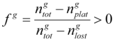

# Generation algorithm

The algorithm contains the following steps.

* Arrival times of individual GTUs are determined using the inter-arrival time generator. At the arrival times, characteristics for the GTU are drawn from the GTU characteristics generator. It is important this occurs at the right time, as for instance the probability of trucks (a GTU characteristic) may vary over time.
* At the same time a position is drawn using the position component. 
* The characteristics for the GTU are added to a queue. Each position the GTU generator uses, has a separate queue. If there is only 1 GTU in a queue, an attempt to place it on the network is undertaken.
* Whether a GTU can be placed is determined with the room checker, which not only determines whether the GTU can be placed, but also at what speed and at what exact location (near the generation position). An ID is generated if the GTU can be placed.
* If a GTU cannot be placed, it remains in the queue. So long as the queue is not empty, another placement attempt for the first GTU in the queue is made every 0.1s. GTUs that cannot be placed are not shifted to another position. Rather, drawing a position depends on queue lengths such that traffic automatically distributes over the available positions. This is further explained in section [Positions](/traffic-demand-and-vehicle-generation/positions).

From this description it follows that GTU generation is highly flexible, as many aspects are delegated to interchangeable components.

## Generating platoons

A first approach to generate platoons is to use Markov chains as described in section [Markov chain for GTU types](/traffic-demand-and-vehicle-generation/traffic-from-an-origin-destination-matrix#markov-chain-for-gtu-types). With high correlation, GTUs of a specific type are likely to follow one another. But there is no guarantee over platoon lengths or time between platoons.

To gain control of vehicle generation regarding platoon lengths the class Platoons can be used. This occurs in five steps per position where such platoons are generated:

1.  A `Platoons` object is created coupled to a position. To generate GTU characteristics either a `LaneBasedGtuCharacteristicsGenerator` or, in case demand is based on OD information, a `LaneBasedGtuCharacteristicsGeneratorOd` is used.
2.  A new platoon is initialized using `addPlatoon(…)`. This method defines the start and end time. If origin, destination and category are fixed for GTUs that are consecutively created in step 3, the method `fixInfo(…)` can be used once for such a group. 
3.  Each GTU in a platoon is created with `addGtu(…)` which defines the arrival time, and optionally the origin, destination and category.
4.  Step 3 is repeated for each GTU in a platoon and step 2 is repeated for every new platoon at the location. 
5.  Finally the method `start(…)` will start the chain of generation events.

It should be noted that this algorithm disables the vehicle generator that is coupled to a Platoons during each platoon, but only pertaining to lanes that are included in the position. This means that the overall demand pattern is affected. One could compensate for this by manually adjusting the demand pattern, or adding a negative number of trips in an OD matrix. The easiest way, however, is to use the method `compensate(…)` of the `Platoons` class. This can be done after steps 1 – 4 of the above procedure and before the vehicle generators are created (e.g. before an OD matrix is created and used to create vehicle generators). Demand compensation is applied per group _g_ (`Category` or `GtuType`) as:

* The total number of vehicles that is in the demand is calculated (<i>ngtot</i>).
* The total number of vehicles that is in the demand during periods that the vehicle generator is disabled is calculated (<i>nglost</i>).
* The total number of vehicles that is generated as part of platoons is known from the defined platoons (<i>ngplat</i>).
* For the specific group g, the demand factor <i>fg</i> is then calculated as the equation below.

Applying this factor on the demand of g ensures that together with the platoons, the same total number of vehicles is generated.
