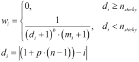

# Positions

The general purpose GTU generator is able to generate traffic over multiple locations. As such, the GTU generator can be used to generate traffic for:

* A zone, made up from a set of links, each having a set of lanes.
* A link, made up from a set of lanes.
* A lane.

For GTU generators only operating on lower levels, the higher levels simply have a single instance. For example, a generator on 1 lane has 1 zone and 1 link. The positions for a generator can easily be created with static methods `GeneratorPositions.create(…)`. These methods figure out from a complete set of lane positions, how these need to be grouped over links and placed in the zone/link/lane hierarchy. Users of GTU generators do not need to consider the hierarchy, but simply provide a full set of available lane positions. Optional information that can be provided to the create(…) methods is i) lane biases to let GTUs favor certain lanes, discussed in section 3.7.1, and ii) weights for links. If link weights are provided, a draw weight for all concerned links needs to be provided. If no link weights are provided, each link receives a weight equal to the number of available lanes for the GTU type of the GTU to be generated.

<pre>
Lane-based GTU generator
&lfloor; <b>Positions</b>
  &lfloor; Zone position
    &lfloor; {Link position} (drawn by provided weight, or number of lanes)
      &lfloor; {Lane position} (drawn by weight from lane biases if provided)
      &lfloor; <i>Weight</i>
  &lfloor; <i>Lane biases</i>
</pre>

A lane position may be drawn using lane biases for GTU types, as explained in the next section.

## Lane biases

When distributing traffic over the lanes of a link, it is important that:

* Traffic is distributed by speed, with fast traffic on the faster lanes and trucks mostly on the slowest lane but certainly not on a 3rd lane, etc. Without this, traffic will need to perform many lane changes after being generated, either causing traffic to not be representable over a considerable distance, or creating unreasonable disturbances.
* Traffic has a reasonable distribution of flow over the lanes. These relations are complex, model dependent, and highly dependent on the overall traffic volume. For instance, in quiet traffic most traffic will be on the right-hand lanes, while in busy traffic the fastest lane may become the busiest lane. Heuristics here are aimed at a reasonable representation in busy traffic, as traffic may easily settle towards slower lanes in quieter traffic.
* In case a lane is saturated or is experiencing spillback, other lanes should become more favorable (higher weight), without quickly violating the above requirements.

To express these requirements there is a weight formula, where parameters may be different for different GTU types. We however leave out GTU type-specific notation. The weight <i>wi</i> for lane <i>i</i> is determined with the equation below, where <i>i</i> is the lane number counting from right to left. The absolute deviation of lane <i>i</i> from the desired lateral position on the road is <i>di</i>. The desired lateral position on the road is given by <i>p</i> where 0 means right, and 1 means left. This is translated to a lane number starting at 1 for the right-hand lane by 1&nbsp;+&nbsp;<i>p</i>(<i>n</i>&nbsp;–&nbsp;1), where <i>n</i> is the number of lanes. If the lateral deviation <i>di</i> is larger than <i>nsticky</i>, the weight <i>wi</i> is 0 and no GTU is generated on these lanes (of the GTU type with given bias parameters). This is suitable to for instance force trucks on the right-most two lanes. If <i>nsticky</i> is 1, and the desired lateral position falls in between two lanes, traffic may be generated on both lanes as for both <i>di</i>&nbsp;&lt;&nbsp;1 will hold. Furthermore, if the desired position is not on either edge, left or right, the number of acceptable lanes is also higher as lanes in both directions with limited lateral deviation <i>di</i> are available.

If <i>di</i>&nbsp;&lt;&nbsp;<i>nsticky</i>, a weight formula is applied. The maximum weight is 1, and this is reduced as the deviation <i>di</i> is larger, as the bias strength <i>b</i> is larger, and as the number of GTUs in the generation queue on the lane <i>mi</i> is larger. The formula has the following properties:

* If <i>di</i>&nbsp;=&nbsp;0, (<i>di</i>&nbsp;+&nbsp;1)<i>b</i> is 1 no matter the bias strength <i>b</i>, meaning that the bias does not reduce the weight on the desired lateral position.
* If <i>b</i>&nbsp;=&nbsp;0, (<i>di</i>&nbsp;+&nbsp;1)<i>b</i> is 1 no matter the lateral deviation <i>di</i>, meaning that the bias does not reduce the weight on any lane if there is no bias.
* If <i>mi</i>&nbsp;=&nbsp;0, the queue size does not reduce the weight on the lane.

The equation automatically balances lane bias with queue length, while obeying <i>nsticky</i> strictly, encouraging other GTU types to occupy the other lanes. Suppose we have a strong bias of <i>b</i> = 5, then, only when <i>mi</i> = 31 on a lane with <i>di</i> = 0, and <i>mi</i> = 0 on the next lane, will the weights on both lanes become equal. If both lanes have no queue, the ratio of generated GTUs on both lanes will be 0.03125 : 1. For <i>b</i> = 2 this becomes 0.25 : 1, for <i>b</i> = 1 this becomes 0.5 : 1, and for <i>b</i> = 0 this becomes 1 : 1. Note that in theory a negative bias could be used, which repels GTUs from the ‘desired’ lateral lane position.

The desired lateral position <i>p</i>, a value from 0 (right) to 1 (left), can either be fixed, or depend on the desired speed of the GTU to be generated. Note that the latter requires the strategical factory to allow the desired speed to be peeked before the GTU is generated.

The class `LaneBias` has many ready-to-use biases as static fields, additional to a static method `bySpeed(…)` which creates a bias where the desired lateral position is determined by interpolating the desired speed between two given speeds. For example, for trucks `LaneBias.TRUCK_RIGHT` can be used, which has <i>p</i>&nbsp;=&nbsp;0&nbsp;(right), <i>b</i>&nbsp;=&nbsp;5&nbsp;(strong bias) and <i>nsticky</i>&nbsp;=&nbsp;2&nbsp;(up to two lanes). For cars `LaneBias.bySpeed(80, 130)` may for example be used, to spread cars between those two desired speeds from right to left.
