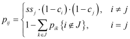
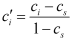

# Traffic from an Origin-Destination matrix

Setting up GTU generators takes a considerable effort, as the previous sections point out. Demand data has to be prepared, and factories have to be set up. A utility takes away most of the effort if an OD matrix is available. This utility is `ODApplier.applyOD(…)`, which takes a network, an OD matrix, and a set of options. The options mainly determine which sub-components the GTU generators will use.

The utility sets up an inter-arrival time generator for each GTU generator by using the OD matrix. Internally it uses a 3-layered node-tree, where each node represents demand. To each generator, a root node wrapped in an arrivals headway generator (the root node represents an `Arrivals` object) is provided from which the generator obtains headways. The root node represents the origin. Destinations are found in the second layer, while categories are found in the third layer. Each of these nodes can have its own form of demand data, with varying time vectors, and varying interpolation. The nodes in the 1<sup>st</sup> and 2<sup>nd</sup> layer work according to a simple delegate principle:
* When the frequency at a specific time is requested, this is a sum of the frequencies from the nodes in the next layer.
* When the start time of the next time slice is requested, this is the first time reported by any node in the next layer.

And these two inputs are all that the arrivals headway generator requires to determine the inter-arrival times (next to a separate headway distribution).

<pre>
Lane-based GTU generator
&lfloor; Inter-arrival time generator
  &lfloor; Arrivals headway generator
    &lfloor; <b>Arrivals</b>
      &lfloor; <i>Lane</i> (this layer is only active if the Category includes a lane)
        &lfloor; Origin
          &lfloor; {Destination}
            &lfloor; {Category} (only those with Lane, if the Category includes a lane)
</pre>

If the category contains the lane, a GTU generator is set up for each lane. Each receives its own root node (origin) and a full set of destination nodes in the second layer. Nodes of the 3<sup>rd</sup> category layer are assigned to the tree concerning the lane in the category. Hence lanes are only a temporal intermediate layer. Once the GTU generator is created, it just has a single root node representing the origin.


## Options for GTU generation

The utility to create GTU generators from an OD matrix accepts options which determine details of the GTU generation. These options can be provided at several levels:

* Overall OD matrix
* Link type
* Origin
* Lane

When the utility requests an option, the value that is most specific is obtained, which is from bottom to top in the above list. If the option is not assigned any value, a default value is used. The following options, available as static fields in `ODOptions`, are available to the utility.

_Table 1: Overview of options for the utility to create GTU generators from an OD matrix._
<table>
    <tr><th>Option</th><th>Type</th><th>Default value</th><th>Comment</th></tr>
    <tr><td><code>HEADWAY_DIST</code></td><td><code>HeadwayDistribution</code></td><td><code>EXPONENTIAL</code></td><td>Headway distribution for the arrivals headway generator.</td></tr>
    <tr><td><code>GTU_ID</code></td><td><code>IdGenerator</code></td><td><code>IdGenerator("")</code></td><td>Generator for GTU ID’s.</td></tr>
    <tr><td><code>GTU_TYPE</code></td><td><code>GTUCharacteristicsGeneratorOD</code></td><td><code>DefaultGTUCharacteristicsGeneratorOD</code></td><td>Determines the GTU characteristics as explained in section <a href="#gtu-characteristics">GTU characteristics</a>.</td></tr>
    <tr><td><code>ROOM_CHECKER</code></td><td><code>RoomChecker</code></td><td><code>CFBARoomChecker</code></td><td>Determines if a GTU can be generated.</td></tr>
    <tr><td><code>MARKOV</code>*</td><td><code>MarkovCorrelation</code></td><td><code>null</code></td><td>Grouping of GTU types generated as explained in section <a href="#markov-chain-for-gtu-types">Markov chain for GTU types</a>.</td></tr>
    <tr><td><code>LANE_BIAS</code></td><td><code>LaneBiases</code></td><td><code>TRUCK_RIGHT</code>, and <code>WEAK_LEFT</code> for others</td><td>Lateral lane bias as discussed in section <a href="positions#lane-biases">Lane biases</a>.</td></tr>
    <tr><td><code>NO_LC_DIST</code></td><td><code>Length</code></td><td><code>null</code></td><td>Distance after generation during which GTUs may not change lane.</td></tr>
    <tr><td><code>INSTANT_LC</code></td><td><code>Boolean</code></td><td><code>false</code></td><td>Instant lane changes.</td></tr>
    <tr><td><code>ERROR_HANDLER</code></td><td><code>GTUErrorHandler</code></td><td><code>GTUErrorHandler.THROW</code></td><td>How to handle GTU errors.</td></tr>
</table>
*)  Advised to only use at origin level and for origins with 1 connecting link. Requires the OD categorization to include GTU type.

The `NO_LC_DIST` option is useful in scenarios with multiple-lane origin links with high demand. Lane changes at the start interfere with the GTU generation on other lanes. For instance, the generation of GTUs is delayed as another GTU just changed lane such that insufficient space is available. If the system boundary would not be there, that GTU would have likely not changed lane as the GTU to be generated is its potential nearby follower.

Two complex options are discussed in the following sections.


## GTU characteristics

The utility prepares a GTU characteristics generator for the GTU generators, of type `GTUCharacteristicsGeneratorODWrapper`. It obtains from the 3-layered node-tree of demand the origin node, and draws the destination node and OD category for a next GTU, depending on various current intensities of the destinations and categories. This information is forwarded to an internal `GTUCharacteristicsGeneratorOD`, which is similar to any other GTU characteristics generator except that it additionally accepts the origin node, destination node and OD category to determine the characteristics.

<pre>
Lane-based GTU generator
&lfloor; GTU characteristics generator
  &lfloor; GTU characteristics generator OD wrapper
    &lfloor; <b>GTU characteristics generator OD</b>
      &lfloor; <i>DefaultGTUCharacteristicsGeneratorOD</i>
        &lfloor; <i>GTU type generator</i>
        &lfloor; <i>Templates {TemplateGTUType}</i>
        &lfloor; <i>Route generator</i>
        &lfloor; <i>Strategical planner factory supplier OD</i>
        &lfloor; <i>Vehicle model factory</i>
</pre>

The default implementation is `DefaultGTUCharacteristicsGeneratorOD`, which does the following:

* If the OD category contains a GTU type, a GTU of that type is generated. Otherwise, if there is a generator, it is used to draw a GTU type. If neither is defined, a car is generated.
* If a GTU type template is provided to the `DefaultGTUCharacteristicsGeneratorOD` for the GTU type, it is used to obtain GTU length, width, etc. Otherwise, default values for common GTU types are used.
* If the OD category contains a route, that route is used. Otherwise a route is determined by a route generator. For instance `RouteGeneratorOD. getDefaultRouteSupplier(…)` returns a generator which provides the shortest route from origin to destination. If no route supplier is provided, the route will be `null`, which might be ok on some simple networks.
* If a strategical planner factory supplier was provided, it is used to obtain a strategical planner factory. Otherwise factories for a default LMRS model are created.
* If a vehicle mode factory is given, it is used to generate a vehicle model. Otherwise `VehicleModel.MINMAX` is used by default.

By default the `GTU_TYPE` option has a `DefaultGTUCharacteristicsGeneratorOD`, without templates, without a route generator, without a strategical planner factory supplier, and without a vehicle model factory. This means default GTU characteristics (length, width, etc.), `null` routes, a default LMRS model are used and `VehicleModel.MINMAX` are used. For cases where this functionality is not sufficient, either some of the information needs to be specified in `DefaultGTUCharacteristicsGeneratorOD` or an implementation of `GTUCharacteristicsGeneratorOD` needs to be made, and set as `GTU_TYPE` option value. In section [How to set up model factories when using an OD matrix](/tutorials/simulation-setup#how-to-set-up-model-factories-when-using-an-od-matrix) a tutorial is available that gives some examples on how to use `DefaultGTUCharacteristicsGeneratorOD` or how to implement `GTUCharacteristicsGeneratorOD`.

## Markov chain for GTU types

A Markov chain describes that any given system state, is likely to arise with a certain probability given the previous traffic state. This applies to vehicle generation too. For example when 10% of traffic is trucks, the vehicle following a truck is another truck with a probability of >10% as trucks tend to form platoons to some extent. The GTU type is the system state used for GTU generation.

The Markov chain is applied within the 3-layered node-tree for demand. Based on the previous GTU type, a next GTU type is determined. Then, a category is randomly drawn only from the categories that contain the next GTU type.

The remainder of this section describes the Markov algorithm, such that an understanding can be obtained in setting the correlation values that the Markov algorithm uses. A Markov chain is described by a transition matrix, which provides NxN probabilities for the system to move from any of N states, to the next state. Overall, the probabilities work out in to a steady-state, which describes the overall probabilities at which the states occur. In the case of vehicle generation, the steady-state is known, as the ratio between GTU type demand at any moment in time is known. From the steady-state, a transition matrix needs to be derived.

Suppose we have states Car (70%), Van (20%) and Truck (10%). A non-correlated transition matrix is given below, where each row represents the previous state, and each column the next state.

<table>
    <tr><td>&nbsp;</td><th>Car</th><th>Van</th><th>Truck</th></tr>
    <tr><th>Car</th><td>0.7</td><td>0.2</td><td>0.1</td></tr>
    <tr><th>Van</th><td>0.7</td><td>0.2</td><td>0.1</td></tr>
    <tr><th>Truck</th><td>0.7</td><td>0.2</td><td>0.1</td></tr>
</table>

Note that each row sums to 1, as from each previous state, a new state (column) must follow. At this point the Markov chain has no effect, as GTU types are completely independent. For GTU generation, a correlation can be specified for a GTU type. Suppose we state that trucks are correlated by a factor of <i>c<sub>truck</sub></i>&nbsp;=&nbsp;0.4, then, the probability a truck will follow a truck becomes 0.1&nbsp;+&nbsp;<i>c<sub>truck</sub></i>(1&nbsp;–&nbsp;0.1)&nbsp;=&nbsp;0.46, as in the left table below. Now, the 3<sup>rd</sup> row does not sum to 1, which needs to be corrected. At the same time, the steady-state cannot be changed as this is a given. The steady-state remains the same for as long as the transition matrix is reversible. We use that:

* A transition matrix is reversible if all values in a column, except for values on the diagonal, are the same.
* A transition matrix remains reversible when <i>scaling symmetrical pairs</i>.

This means that the matrix we start with as given above is reversible. Thus, if we scale symmetrical pairs the matrix remains reversible and the steady-state is not changed. To compensate for the increased probability in the 3rd row, we reduce the other two probabilities in the 3<sup>rd</sup> row by the same factor, being 0.6, bringing the row sum back to 1. As the middle matrix below shows, we also scale the symmetrical pairs in the 3<sup>rd</sup> column by the same factor.
<table>
    <tr><td>&nbsp;</td><th>Car</th><th>Van</th><th>Truck</th><td>&nbsp;</td><td>&nbsp;</td><th>Car</th><th>Van</th><th>Truck</th><td>&nbsp;</td><td>&nbsp;</td><th>Car</th><th>Van</th><th>Truck</th></tr>
    <tr><th>Car</th><td>0.7</td><td>0.2</td><td>0.1</td><td>&nbsp;</td><th>Car</th><td>0.7</td><td>0.2</td><td>0.06</td><td>&nbsp;</td><th>Car</th><td>0.74</td><td>0.2</td><td>0.06</td></tr>
<tr><th>Van</th><td>0.7</td><td>0.2</td><td>0.1</td><td>&nbsp;</td><th>Van</th><td>0.7</td><td>0.2</td><td>0.06</td><td>&nbsp;</td><th>Van</th><td>0.7</td><td>0.24</td><td>0.06</td></tr>
<tr><th>Truck</th><td>0.7</td><td>0.2</td><td>0.46</td><td>&nbsp;</td><th>Truck</th><td>0.42</td><td>0.12</td><td>0.46</td><td>&nbsp;</td><th>Truck</th><td>0.42</td><td>0.12</td><td>0.46</td></tr>
    </table>

At this point, rows 1 and 2 no longer sum to 1. This can simply be compensated by changing the values on the diagonal in these rows, as visible in the right matrix above. Changing the diagonal does not affect reversibility. Each value in the resulting matrix is given by the equation below, which applies generally for any steady-state <i>ss</i>, and any set of correlations <i>c</i>. The values in case of <i>i</i> ≠ <i>j</i> consist of three components: 

* <i>ss<sub>j</sub></i>; the steady state probability we start with
* (1&nbsp;&#8209;&nbsp;<i>c<sub>i</sub></i>); reduction of values in row <i>i</i> except for on the diagonal, to let the row sum to 1
* (1&nbsp;&#8209;&nbsp;<i>c<sub>j</sub></i>); reduction according to the principle of scaling symmetrical pairs

Values on the diagonal <i>i</i>&nbsp;=&nbsp;<i>j</i> are simply 1 minus the other values in the row, which reflects both <i>c<sub>i</sub></i> through the other row values adjusted by (1&nbsp;&#8209;&nbsp;<i>c<sub>i</sub></i>), and compensation for other correlations.



The resulting steady-state in the example is not changed as is shown by the following equations regarding each column:

* 0.7·0.74 + 0.2·0.7 + 0.1·0.42 = 0.7
* 0.7·0.2 + 0.2·0.24 + 0.1·0.12 = 0.2
* 0.7·0.06 + 0.2·0.06 + 0.1·0.46 = 0.1

This analysis also shows that if correlation is added to one GTU type, other GTU types will automatically also be more likely to be consecutive, as the entire diagonal is increased. This is logical, because when you take out trucks from a string of vehicles to group them together, the remaining vehicles are more likely to be consecutive to each other.

Every time a next GTU type needs to be determined, only 1 row of the transition matrix needs to be determined. Namely, the row pertaining to the previous GTU type. With GTU type correlations predetermined, and a steady-state derived from the current demand pattern, this row can be calculated using the equation above.


## Nested Markov chain for GTU types

So far Markov chains for GTU generation have been explained where one GTU type correlates to itself, but correlations between GTU types are also possible. For instance, suppose we have a simulation with trucks and CACC trucks, then, the probably of each should be increased when the previous GTU type is of either type. To this end the Markov chain supports grouping GTU types. The group becomes a single state for the transition matrix, who’s correlation is defined by the group super state. That is, the GTU type all types in the group are a subtype of. In the example this means we have a state ‘truck or CACC truck’, who’s correlation is given by the correlation of GTU type truck.

The group itself is a nested transition matrix, which only contains the states of the group. Should the new state in the chain be a submatrix, the submatrix is requested to specify the state further to a particular GTU type. The group as a new state may result from any previous state, including previous states that are not part of the sub group. In that case, the submatrix uses steady-state probabilities without correlation. This maintains the overall steady-state as is shown in the following example.

Suppose we have 80% cars and 20% truck with <i>c<sub>truck</sub></i>&nbsp;=&nbsp;0.4. This gives the following transition matrix. 

<table>
    <tr><td>&nbsp;</td><th>Car</th><th>Truck</th></tr>
    <tr><th>Car</th><td>0.88</td><td>0.12</td></tr>
    <tr><th>Truck</th><td>0.48</td><td>0.52</td></tr>
</table>

Next, we equip 25% of the trucks (5% of all traffic) with CACC. For the moment we assume no different correlation for these trucks, hence <i>c<sub>cacc</sub></i>&nbsp;=&nbsp;0.4. Giving trucks and CACC trucks their own independent correlation, the following transition matrix follows. There are some undesired outcomes, given that the inclusion of CACC should under the current assumptions not influence the traffic composition:

* The probability of a car following a car is reduced from 0.88 to 0.731.
* If the previous GTU was a truck, and the next one is a truck or CACC truck, the probability the next GTU is a CACC truck is 0.124&nbsp;/&nbsp;(0.545&nbsp;+&nbsp;0.124)&nbsp;=&nbsp;18.6%, rather than 25%.
* Similarly, if the previous GTU was a CACC truck, and the next one is a truck or CACC truck, the probability the next GTU is a CACC truck is 0.632&nbsp;/&nbsp;(0.037&nbsp;+&nbsp;0.632)&nbsp;=&nbsp;94.4%, rather than 25%.

<table>
    <tr><td>&nbsp;</td><th>Car</th><th>Truck</th><th>CACC</th></tr>
    <tr><th>Car</th><td>0.731</td><td>0.062</td><td>0.207</td></tr>
    <tr><th>Truck</th><td>0.331</td><td>0.545</td><td>0.124</td></tr>
    <tr><th>CACC</th><td>0.331</td><td>0.037</td><td>0.632</td></tr>
</table>

The solution is to see GTU types truck and CACC truck as a group with correlation 0.4, keeping the value 0.52 in the overall transition matrix. If the previous GTU is either a truck or a CACC truck, that value applies. If, from whatever previous state, the overall matrix results in a next state ‘truck or CACC truck’, the submatrix of the group determines the actual state. Within the group no correlation needs to be considered, as we assumed a correlation of 0.4 on both types in the group, relative to all other traffic. Thus, the 2x2 matrix would contain the steady-state 75%-25%. Within the overall matrix, this occurs with a factor 0.52, hence the group matrix can be multiplied by 0.52 resulting in {0.39, 0.13} as in the following matrix. Additionally, the submatrix has to return a next state in case the previous state was not any state within the group, i.e. car. Again, the steady-state applies, but in this case this would even be true if the group had correlation inside. The value of 0.12 in the overall matrix applies to the steady state, resulting in {0.09, 0.03}.

<table>
    <tr><td>&nbsp;</td><th>Car</th><th>Truck</th><th>CACC</th></tr>
    <tr><th>Car</th><td>0.88</td><td>0.09</td><td>0.03</td></tr>
    <tr><th>Truck</th><td>0.48</td><td>0.39</td><td>0.13</td></tr>
    <tr><th>CACC</th><td>0.48</td><td>0.39</td><td>0.13</td></tr>
</table>

This transition matrix has all desired properties:

* The steady-state of 80%-15%-5% is maintained
* 88% of GTUs behind a car is another car
* 48% of GTUs behind either a truck or CACC truck is a car
* 25% of trucks and CACC trucks behind either a truck or CACC truck, is a CACC truck
* 25% of trucks and CACC trucks behind a car, is a CACC truck

Note that the latter has to be true if 25% of trucks and CACC trucks overall is a CACC truck, given that the same is true within the group (i.e. nothing needs to or should be compensated).

Within the subgroup we can introduce correlation. For example, we might assume that CACC trucks are more likely to platoon than regular trucks. Suppose we assume <i>c<sub>cacc</sub></i> = 0.64. We cannot use this value directly within the group, as the group already inhibits a correlation of 0.4. This means that within the group, a correlation of 0.4 is mapped to 0.0, as in the uncorrelated group example above. The highest possible correlation of 1 is mapped to 1. Hence, we can scale any correlation of a state in the group, to a correlation to be used in the submatrix according to the equation below, where <i>c<sub>i</sub></i> is the correlation of state <i>i</i>, <i>c<sub>s</sub></i> is the correlation of the super state (i.e. of the group as a whole), and <i>c’<sub>i</sub></i> is the correlation to be used inside the submatrix.



Applying this to our example we get <i>c’<sub>cacc</sub></i>&nbsp;=&nbsp;0.4. Calculating the 2x2 matrix and scaling it by 0.52 we obtain the following matrix.

<table>
    <tr><td>&nbsp;</td><th>Car</th><th>Truck</th><th>CACC</th></tr>
    <tr><th>Car</th><td>0.88</td><td>0.09</td><td>0.03</td><tr>
    <tr><th>Truck</th><td>0.48</td><td>0.442</td><td>0.078</td><tr>
    <tr><th>CACC</th><td>0.48</td><td>0.234</td><td>0.286</td><tr>
</table>

With the 2x2 group maintaining the internal steady-state of 75%-25%, all earlier mentioned desired properties still hold, with the added property that CACC trucks are more likely to follow each other.

Concluding, complex transition matrices including correlations between GTU types can be created solely by defining correlations for individual GTU types, capturing correlations between GTU types only by grouping. The full example is created with the following code. Note that `GTUType.CAR` is not added, as states with 0 correlation are automatically implied when a new state is determined.

```java
    MarkovCorrelation<GTUType, Frequency> markov = new MarkovCorrelation<>();
    GTUType truck = DefaultsNl.TRUCK;
    GTUType caccTruck = new GTUType("caccTruck", truck);
    markov.addState(truck, 0.4);
    markov.addState(truck, caccTruck, 0.64);
```
