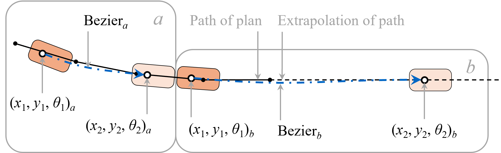

# Dead reckoning

## Introduction
Dead reckoning is used in systems that need a current state but need to be robust for missing or delayed data. For the purpose of co-simulation, dealing with data delay is important. Even if delays are small, errors should not occur if a state is not known during the delay. Moreover, the update of the state when information is received should comply to requirements. These requirements are:

- **Realistic movement**; Depending of the purpose of the simulation, jumps in the position, orientation, or speed of a vehicle degrade the validity of the simulation results. For example, in a driver simulator, the vehicle may be perceived to be unreliable, or may be recognizable as a type of actor violating experimental requirements.
- **Data integrity**; Jumps in the data can cause various data inconsistencies. Emissions calculated based on trajectories can become very unreliable. Detectors can be skipped or triggered multiple times.

Dead reckoning can be achieved at different levels of complexity. The last known location/orientation/speed can be extrapolated, this extrapolation may follow road curvature, or a complete surrogate model may be utilized for the extrapolation. Depending on the delay, more complexity can be required. For co-simulation with OTS small delays are assumed. Therefore, dead reckoning is implemented as kinematic extrapolation of the last known location, orientation, speed and acceleration.

## Dead reckoning in OTS
Dead reckoning is applied in OTS for vehicles that are externally controlled, including vehicles with hybrid control. The basic idea is to predict a future state based on the latest information, and give the vehicle a plan that will bring it from its current location to the future location and orientation, at the correct time, and approximately at the correct speed and acceleration. The latest vehicle information is given by location and orientation $(x_0, y_0, \theta_0)$ and kinematics of time, speed and acceleration $(t_0, v_0, a_0)$.

The future moment considered is $t_{horizon}$ in the future. To compute the future time $t_f$ relative to the latest data at $t_0$, the following equation is used. It includes the data delay relative to current time $t$. As clocks between simulators may not be fully synchronized and delays can be small, negative delay values can occur. These are maximized to 0.

$$
t_f=max(0, t-t_0) + t_{horizon}
$$

Within this time a vehicle may come to a full stop. Therefore the movement time $t_{move}$ is calculated as:

$$
t_{move} = \begin{cases}
min(t_f, \frac{v_0}{-a_0}), & a_0 < 0 \\
t_f, & \text{otherwise}
\end{cases}
$$

The distance that the vehicle is expected to move within this time $s_{horizon}$ is given by:

$$
s_{horizon} = v_0 \cdot t_{move} + \frac{1}{2} \cdot a_0 \cdot t_{move}^2
$$

Based on previous dead reckoning the current position of a vehicle can have lateral deviation relative to a new received state. At low speeds this lateral deviation can be significant relative to the longitudinal deviation. To prevent extreme lateral movement the target point is extrapolated a minimum distance $s_{min}$ away from the latest received state. The extrapolated distance $s_{target}$ is given by:

$$
s_{target} = max(s_{horizon}, s_{min})
$$

This gives a target point $(x_2, y_2, \theta_0)$ extrapolated from the latest state (note, with the same orientation). A path with the shape of a Bezier is determined from the current vehicle position $(x_1, y_1, \theta_1)$ to the target point. This path has a length $l_{path}$.

To reach the target point at the future time, acceleration should be adjusted such that the actual path length in covered based on current vehicle speed $v_1$, except when the minimum extrapolation distance $s_{min}$ came in to play. Acceleration is given as:

$$
a = \begin{cases}
a_0, & s_{min} > s_{horizon} \\
2 \cdot \frac{l_{path} - v_1 \cdot t_{move}}{t_{move}^2}, & \text{otherwise}
\end{cases}
$$

Dead reckoning is implemented in the class `DeadReckoning`. The value for $t_{horizon}$ can be set as a command line argument on the OTS transceiver, see [Settings and parameters](settings-parameters.md#general). For larger delays in a simulator setup, larger horizon values may be used at the cost of deviations being corrected slower. The minimum extrapolation distance $s_{min}$ is set to 1m.

## Dead reckoning in the external simulator
This section discusses suggestions for the implementation of dead reckoning in the external simulator. It depends on the application whether dead reckoning is required, and if so, in what form. Here, the same context is assumed as for dead reckoning in OTS. That is, small delays are assumed, for which an extrapolation based on orientation in the last information is sufficient. However, the information that OTS sends to the external simulator is a plan message (see [Messages](messages.md#plan-message)). This contains a path, speed profile, and acceleration profile for some duration. Only after this plan will a new plan be sent by OTS, received with some communication delay by the external simulator. Rather than extrapolating from a last known position, the plan can be used to interpolate, or, when determining a point at a time after the end of the plan, extrapolate from the last location in the plan. This is visualized in the figure below. Note that the current position $(x_1, y_1, \theta_1)$ is not exactly on the path of the plan. For moment _b_ extrapolation is applied for the target point $(x_2, y_2, \theta_2)$.

{ width=60% }
_Figure 8.18: Interpolation and extrapolation on plan data at two moments (a and b)._

Dead reckoning in the external simulator can be updated with a higher frequency than at which plan messages are received. In combination with a relatively short $t_{horizon}$, a vehicle can then closely follow the intended plan in both a smooth manner, and compensating for data delays. The target point $(x_2, y_2, \theta_2)$ can be interpolated from the plan if $t_2$ is before the end of the plan. Otherwise it can be extrapolated from the last location and orientation in the plan.