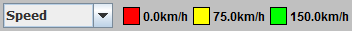

# Visualization

## How to add a GTU colorer

An important way to visualize workings of a simulation is to provide each GTU with a color that represents a value of the GTU. Typically, these are speed, acceleration, etc. To visualize a custom variable, a custom GTU colorer is required. These have to implement interface `GtuColorer`. This interface has two methods: `getColor(Gtu)` and `getLegend()`. The latter is used by OTS to show a user what the colors indicate for the selected GTU colorer, for example as in Figure 8.1.


_Figure 8.1: Legend for the ‘Speed’ GTU colorer._

As an example we are going to create a colorer that indicates whether a driver is on the phone or not. We use three colors, for ‘yes’, ‘no’ and ‘unknown’. The latter is applicable if the GTU for which a color is determined, does not provide such information. With a static code block the legend is created, which is returned in `getLegend()`.

```java
    public class PhoneColorer implements LegendColorer<Gtu>
    {
        private final static Color UNKNOWN = Color.WHITE;
        private final static Color NO = Color.GREEN;
        private final static Color YES = Color.RED;
        private final static List<LegendEntry> LEGEND = new ArrayList<>();
    
        static
        {
            LEGEND.add(new LegendEntry(UNKNOWN, "Unknown", "Unknown whether the driver is on the phone."));
            LEGEND.add(new LegendEntry(NO, "No", "Driver is not on the phone."));
            LEGEND.add(new LegendEntry(YES, "Yes", "Driver is on the phone."));
        }
    
        public List<LegendEntry> getLegend()
        {
            return LEGEND;
        }
    }
```

The class also needs to implement `getColor(Gtu)`. This method may receive any GTU so the colorer has to cope with GTUs that can’t provide the requested information, since it is not part of the default class definitions. We define the functionality of providing the information in a separate interface `PhonePlanner`. Using such an interface allows any tactical planner to provide the information, which can then be visualized with the GTU colorer.

```java
    public interface PhonePlanner
    {
        public boolean isOnThePhone();
    }
```

To return the color, we check whether the tactical planner is an instance of `PhonePlanner`, and if so, request the information.

```java
    public Color getColor(final Gtu gtu)
    {
        if (gtu.getTacticalPlanner() instanceof PhonePlanner)
        {
            return ((PhonePlanner) gtu.getTacticalPlanner()).isOnThePhone() ? YES : NO;
        }
        return UNKNOWN;
    }
```

Similar to interface `PhonePlanner`, OTS has the following interfaces that give a tactical planner the ability to provide information for a particular colorer.

* `DesireBased`; to show lane change desire, for use with `IncentiveColorer`/`DesireColorer`.
* `Synchronizable`; to show synchronization and cooperation, for use with `SynchronizationColorer`.
* `Controllable`; to show whether a GTU is being controlled.

Finally the colorer gets an implementation for `getName()`. The value that this method returns is used in the dropdown list as ‘Speed’ on the left side in Figure 8.1.

```java
    public String getName()
    {
        return "Phone";
    }
```

Multiple colorers can be used by combining them in a `SwitchableGtuColorer`.


## How to add an animation

Animation in OTS is based on DSOL, which in term is based on the standard java tools for graphics and user interfaces. Animation in OTS is two-dimensional and (virtual) world objects are animated one at a time. In fact, each animated object is animated by some animation object. For instance, a `Lane` is animated by a `LaneAnimation`. The `Lane` is not aware of the `LaneAnimation`, but the `LaneAnimation` does use the `Lane` to obtain information for visualization. Animations should extend `Renderable2d<T>`, where `T` is a sub class of `Locatable`. This means that animated objects should be able to report their position and bounds.

In this tutorial an example is shown for a speed sign animation. The class structure is given below. By extending `Renderable2d` the implementation does not have to be concerned with scaling, rotating, etc. This class only has the task to draw the animation around point (0, 0) without rotation. Any rotation as given by the location (`Locatable`) and flipping, translations and scaling (i.e. panning and zooming by the user) is taken care of through transformations in `Renderable2d`. The net unit that the class needs to draw with is meters.

```java
    public class SpeedSignAnimation extends OtsRenderable<SpeedSign>
    {
    
        private static final double RADIUS = 1.6;
    
        private static final double EDGE = 1.3;
    
        public SpeedSignAnimation(final SpeedSign source, final OtsSimulatorInterface simulator)
        {
            super(source, simulator);
            setRotate(false);
        }
    }
```

It is up to the implementation to disable a specific transformation. For example the above class uses `setRotate(false)` to disable rotation. The animation will thus always appear on screen without rotation. This may be preferable for text, and as we will see below, is not important for circular animation.

The class needs to implement method `paint(…)` for the actual drawing, which is given below. It draws a red circle with radius `RADIUS` (1.6m), then a white circle with radius `EDGE` (1.3m), and finally the speed in km/h in black. The font characteristics depend on the number of digits in the speed, resulting in characters of either 1.85m or 2m height.

```java
    public final void paint(final Graphics2D g, final ImageObserver arg1)
    {
        Ellipse2D ellipse = new Ellipse2D.Double(-RADIUS, -RADIUS, 2 * RADIUS, 2 * RADIUS);
        g.setColor(Color.RED);
        g.fill(ellipse);
        ellipse = new Ellipse2D.Double(-EDGE, -EDGE, 2 * EDGE, 2 * EDGE);
        g.setColor(Color.WHITE);
        g.fill(ellipse);
        g.setColor(Color.BLACK);
        int speed = (int) getSource().getSpeed().getInUnit(SpeedUnit.KM_PER_HOUR);
        if (speed < 100)
        {
            g.setFont(new Font("Arial", 0, -1).deriveFont(2.0f));
        }
        else
        {
            g.setFont(new Font("Arial narrow", 0, -1).deriveFont(1.85f));
        }
        String str = Integer.toString(speed);
        Rectangle2D stringBounds = g.getFontMetrics().getStringBounds(str, g);
        g.drawString(str, (float) -stringBounds.getCenterX(), (float) -stringBounds.getCenterY());
    }
```

The resulting animation is given in Figure 5. Despite the location at these signs pointing northeast, the text is horizontal as rotation has been disabled by `setRotate(false)`.


_Figure 8.2: Speed sign animation._

To enable users to enable or disable the animation of a particular kind of object (any type of `Locatable`) OTS provides toggle buttons on the left hand side of the window. Items can be added here using several methods of `OtsAnimationPanel`. When setting up a simulation using `AbstractSimulationScript`, this can be done by overriding `setAnimationToggles(…)` (calling the super implementation to get all default toggle buttons). Methods `addToggleAnimationButtonText(…)` and `addToggleAnimationButtonIcon(…)` add either a check-mark with text label, or an icon button. The icon version has a last boolean input called `idButton`. When `false` a regular toggle button is added. When `true` a toggle button is added to the right hand side of the previously added button. This is used to add buttons that show or hide text labels showing ids. For example, the regular button for `Link`s is accompanied by an id button to the right. The id button toggles the id text in the middle of the link. An example use can be found in class `AnimationToggles`, method `setIconAnimationTogglesFull(…)`. It is important to realize that the text label animates a dedicated `Locatable` extension. This allows the link and its id to be toggled separately.
