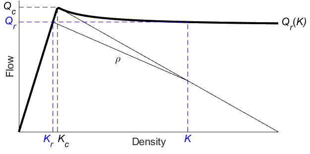
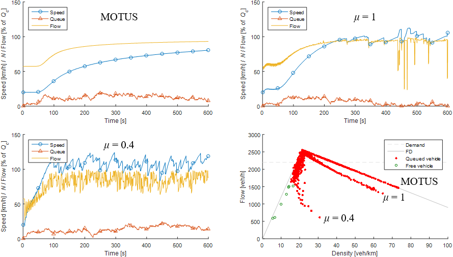

# Appendix B - Vehicle generation under queue spillback

Authors: W.J. Schakel and J.W.C. van Lint

_This work was presented at TRISTAN IX, 12-17 June, 2016, Oranjestad, Aruba_

## 1. Introduction

In microscopic traffic simulation models, vehicle generation methods (VGM) are needed at the upstream boundaries (origin nodes) of the network. These VGM translate (non) destination-specific inflow time series into a sequence of vehicles entering the network, using
assumptions related to the (time) headway distribution. Typical choices are Poisson or Lognormal distributions ([Zhang and Wang, 2014](../10-references/references.md)). A consistency problem occurs when queue spillback from within the simulation reaches the boundary, because in this case it may be no longer possible to ensure that the given demand can enter the network.

Depending on the particular simulation study, either the spillback produced by simulation or the demand data is considered more important. In this paper we introduce a method suitable for when demand data is more important. A typical example is running
simulations with different random seeds using real demand data, where a queue may or may not spill back to the vehicle generator. For comparability of different scenario’s and runs within each scenario, the use of the same demand pattern is important. Intensity of generated traffic should thus revert back to demand as quickly as possible after spillback.

Spillback is allowed for the following reason. The assumed demand may come from a number of sources such as i) simplified demand pattern determined by the modeler, e.g. linearly increasing demand, ii) interface with a higher-level model, e.g. a macroscopic model,
and iii) measurement data. For cases i) and ii) it is clear that if spillback occurs, this should restrict the assumed demand temporarily. For case iii) this is also true as traffic is a highly stochastic process. Measurement data represents just one instance of what might happen under certain circumstances, and simulation simply produces a different (simplified) instance.

In this paper we describe a VGM that has been designed to deal with spillback. This VGM is the default vehicle generator of the microscopic simulation software MOTUS ([Schakel et al., 2013](../10-references/references.md)). The main contribution of this paper is an extension which allows a fast recovery of flow, allowing the assumed demand to enter the network. This is discussed in section 2. Section 3 describes a test case for the vehicle generator. Finally, conclusions are given in section 4.

## 2. Vehicle generation under spillback

In MOTUS the VGM uses the current demand value to determine a headway <i>h</i>, based on a selected headway distribution (e.g. uniform, Poisson). There is a lot of literature on headway distributions (e.g. [Zhang and Wang, 2014](../10-references/references.md)). Simple distributions are parameterized to for instance deal with small headways in the Poisson distribution in relation to safe car-following headways.

In our VGM distributions are simple and non-parameterized. Instead of complex distributions, vehicles are generated in two distinct manners:
<ul>
  <li>A <i>free</i> vehicle <i>i</i> is generated <i>h</i> seconds after the previous vehicle <i>i</i>-1 (<i>ti</i> = <i>ti-1</i> + <i>h</i>), with speed set to the minimum of its desired speed and the speed of <i>i</i>-1. If the desired headway of <i>i</i> is violated, <i>free</i> generation fails and <i>queued</i> generation is attempted.</li>
  <li>A <i>queued</i> vehicle <i>i</i> is generated at a similarly determined speed and at the desired following headway behind <i>i</i>-1. If this is upstream of the network boundary, the queued generation fails and a queue counter <i>N</i> is increased by 1.</li>
</ul>

With this VGM, very small headways from the Poisson distribution result in the generation of queued vehicles. This may occur at free flow speeds, i.e. generating platoons. It may also occur in congestion and thus allows vehicle generation under queue spillback.

Before we describe our extension to this VGM, we analyze what should theoretically occur in case of spillback from either a jam wave or a standing queue. A jam wave at the upstream network boundary will in reality move upstream. Due to the capacity drop, flow out of this jam and thus into the network is below capacity. At some point the jam either solves due to low inflow, or moves past an infrastructural change allowing flows near capacity. Since this occurs outside of the considered network, the exact dynamics and timing are unknown. In case of a standing queue, flow should recover to demand as soon as the queue allows. In either case, flow should recover to demand within a reasonable time frame as soon as traffic on the considered network does not force low flows at the upstream boundary.

For flow to recover, speeds need to become high. For speed to increase, vehicles should be generated with more spacing than the minimum desired headway dictates. Only then will they (considerably) accelerate. Increased spacing suggests reduced efficiency, which is actually perfectly in line with the theoretical description above, i.e. the capacity drop. This may seem counterintuitive, but <i>by momentarily reducing flow even further than dictated by spillback, speeds increase and high flows can be generated again</i>.

To implement this concept we use the theory of bounded acceleration ([Lebacque, 2003](../10-references/references.md)). The most general explanation of this theory is that based on the simple notion of a constant delay of acceleration between vehicles <i>θ</i>, the headway between vehicles will increase the longer they accelerate (i.e. the lower the speed they accelerate from). The capacity drop is thus larger if the speed in congestion is lower. We implement the reduced efficiency by applying a factor <i>f</i> = <i>Kc</i>/<i>Kr</i> > 1 on the desired headway of queued vehicles, where <i>Kc</i> is the critical density and <i>Kr</i> is the recovery density achievable from a congested state with density <i>K</i>. Using shockwave theory this is visually determined as in figure B.1. Note that this diagram depends on the parameters of <i>i</i>. In the full paper this will be explained in detail. What is required is <i>ρ</i>, which is the absolute speed of the acceleration front. It is calculated with equation (1), where <i>V</i>(<i>K</i>) is the equilibrium speed at density <i>K</i>. Looking at the shape of <i>Qs</i>(<i>K</i>) we see reduced efficiency throughout the congested domain allowing flow recovery, quickly rising to <i>Qc</i> just above the critical density allowing capacity at high speeds.

<i>ρ</i> = <i>V</i>(<i>K</i>) - 1 / (<i>θK</i>)&emsp;&emsp;(1) 
 

 
<i>Figure B.1: Recovery flow with bounded acceleration for μ = 1 (θ = 1/Qc).</i>

We only need to determine a value for <i>θ</i>. [Lebacque (2003)](../10-references/references.md) suggests 1/<i>Qc</i> such that theoretically sound wave speeds result (<i>ρ</i> < 0 for <i>K</i> > <i>Kc</i>). However, we are free to select a different value if that lets flow recover more quickly. We introduce <i>μ</i> as a factor on <i>Qc</i>, which changes equation (1) with <i>θ</i> = 1/<i>Qc</i> into equation (2). For lower values of <i>μ</i> flow is initially reduced more such that the queue <i>N</i> increases, but speeds recover faster such that <i>N</i> may start to decrease sooner. A balance between these two factors has to be found with the value of <i>μ</i>.

<i>ρ</i> = <i>V</i>(<i>K</i>) - <i>μQc</i> / <i>K</i>&emsp;&emsp;(2)

## 3. Test case

In this experiment we simulate a single lane of 750m length with initially 20 vehicles driving at 20km/h at the upstream boundary, i.e. simulating spillback. Car-following behavior is simulated with the IDM+ (Schakel et al., 2013) with a capacity of 2553veh/h at a desired headway of 1.2s. Demand is set at 2200veh/h. Based on a deterministic case with initially 5 vehicles, with uniform headways and all vehicles desiring a speed of 120km/h, we find that <i>μ</i> = 0.4 gives the fastest flow recovery (140s for <i>μ</i> = 0.4, 240s for <i>μ</i> = 1, and 510s for MOTUS). However, it increases the initial headway strongly (<i>f</i> > 1) if the speed of a generated vehicle is only slightly below its desired speed. Therefore, we test a case where the desired speed is normally distributed with a standard deviation of 12km/h. Moreover, the headways are Poisson distributed. Results are shown in figure 2. MOTUS is clearly very slow in recovering flow, and its recovery path in the fundamental diagram (FD) is strictly on the congested branch. For <i>μ</i> = 0.4 we see that the queue does not disappear, meaning that the given demand is never generated. With speed differences induced by the speed deviation, the capacity drop is too strong and flow remains at about 80% of capacity. The recovery path in the FD is far from realistic. Finally, for <i>μ</i> = 1 we see relatively fast recovery after about 250s. After that, a small queue remains, which is reasonable as at a demand of 2200veh/s, most vehicles will be following their predecessor in a platoon, i.e. they are queued vehicles. The recovery path in the FD is close to the congested branch and the gap resembles <i>Qc</i> – <i>Qr</i>(K) in figure B.1.

 
<i>Figure B.2: Flow recovery for MOTUS and the VGM with μ = 1 and μ = 0.4.</i>

## 4. Conclusions

We have introduced the theory of bounded acceleration into vehicle generation as a means to recover flow in case of spillback by temporarily reducing inflow, allowing for speeds to increase and the capacity drop to disappear. This vehicle generation method has 1 parameter <i>θ</i>, for which we found most robust results in case of <i>μ</i> = 1 (i.e. <i>θ</i> = 1/<i>Qc</i>). As <i>Qc</i> is determined by the parameters of the generated vehicle, we thus suggest no new parameters.